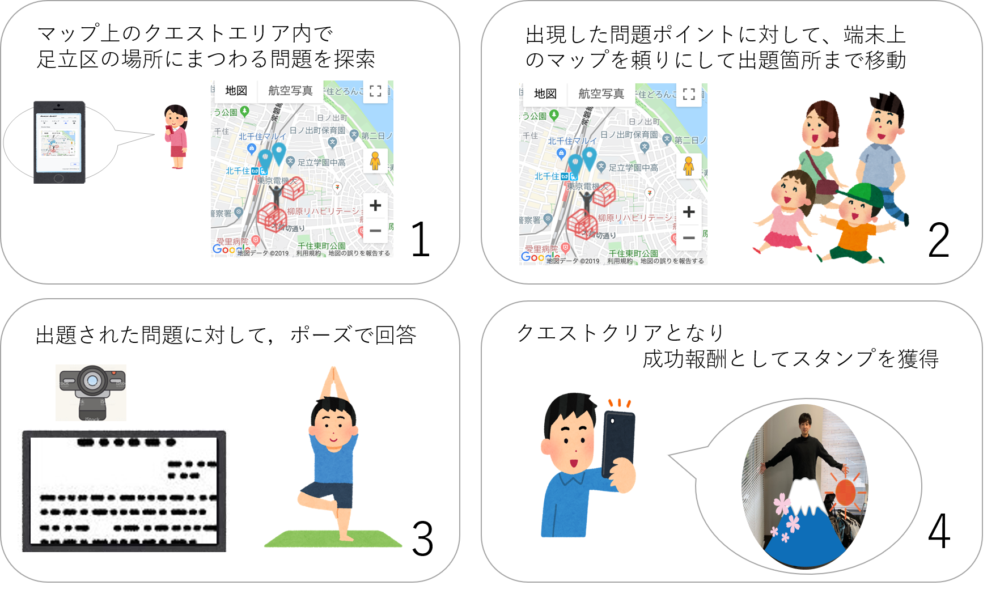

# ADACHI QUEST

[]
(https://www.youtube.com/watch?v=G5rULR53uMk)

[]
(https://www.youtube.com/watch?v=G5rULR53uMk)

## 製品概要
### 地域活性化 X Tech

### 背景（製品開発のきっかけ、課題等）

- 足立区にはよくないイメージがある
- 親子で参加できるようなイベントを提供することにより，地域をよく知り足立区のイメージをよりよくしたい
 
### 製品説明（具体的な製品の説明）
- 足立区内を探索し、マップ上のポイントを巡る(探索)
- 出題エリア入ることでクイズが出題される(発見)
- OpenPoseを利用してクイズの回答・スタンプのポーズ取得を行う(回答)

#### アプリの使用方法

### 特長

#### 1. AI×最新エッジデバイスで新たなスタンプラリーを提案
- 行動認識AIであるOpenPoseを利用し，ユーザのポーズからスタンプを付与
- 最新のAI向けエッジデバイスであるJetson Nanoの利用により，スタンプ台の場所コストを最小化．数年先の未来のスタンプラリーを提案

#### 2. クイズを探す過程でユーザが自然と街を探索
- GPSを利用したマップ上にクイズを結びつけているため、ユーザーは地域を練り歩きながらクイズのポイントを探すことになる
 つまり、各人に魅力を再発見してもらうことができる

### 解決出来ること
- 足立区に対する世間のよくないイメージを改善する
- また、ユーザが街を探索する過程で様々な商業施設を訪れ，街への経済的な効果を期待

### 今後の展望
大きく分けて技術面とサービス面の2点を今後の展望として掲げる

#### 技術面
- 機械学習によるポーズの検出
- 動的なポーズ認識

#### サービス面
- 足立区に限らず全ての市区町村やコンビニエンスストアで開催されるスタンプラリーイベントなどへの転用

## 開発内容・開発技術
### 活用した技術
#### API・データ
- なし
#### フレームワーク・ライブラリ・モジュール
- OpenPose
- Flask
- Vue.js

#### デバイス
- Jetson Nano
- Google Home
- Webカメラ
- スマートフォン(Android,iOS)
### 研究内容・事前開発プロダクト（任意）

- スマートフォン側からアクセスする用のサイト
- 画面のイメージ

### 独自開発技術（Hack Dayで開発したもの）
#### 2日間に開発した独自の機能・技術
- 独自で開発したものの内容をこちらに記載してください
- OpenPoseを利用したポーズ推定とそれに伴うUI
- 推定したポーズに対応するスタンプの付与
- GoogleHomeによる音声応答
- 
* 特に力を入れた部分をファイルリンク、またはcommit_idを記載してください（任意）

